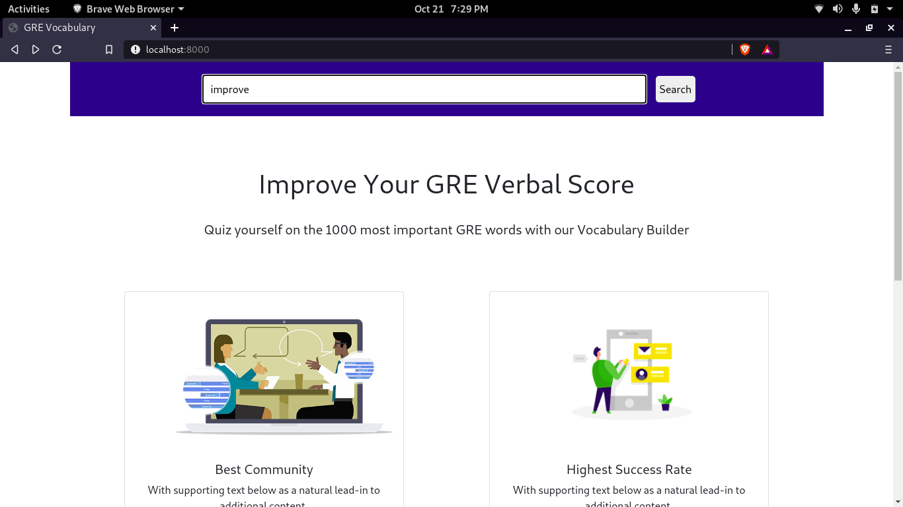
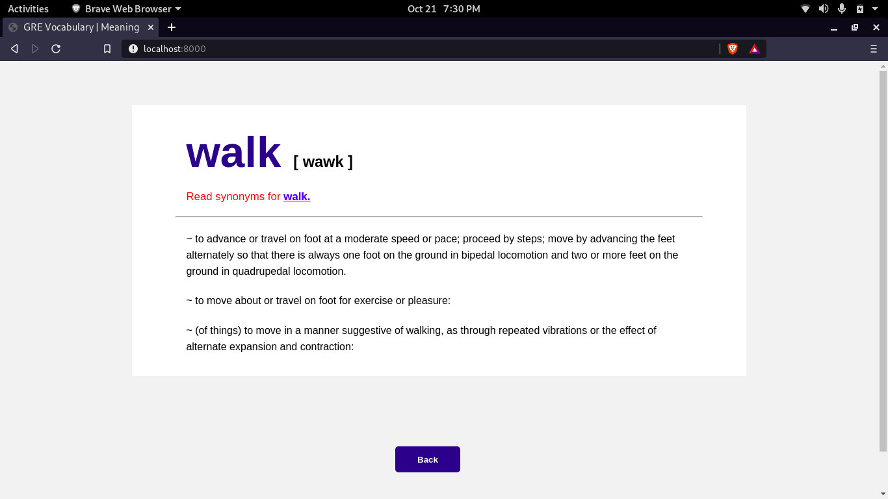

# GRE-Vocabulary-Website

### GRE Vocabulary Website implemented using Express and EJS.

A website for finding meanings and synonyms of any given word in the dictionary. Web scraping is used to fetch data about an input word and then the data is parsed and displayed on the website using EJS. A link for the synonyms of the input word is also generated and displayed in EJS. 

Home Route to search a word : 

Result of the searched word :

Note : There was an issue while uploading files using git so I have uploaded all the files except 'node_modules' folder.
